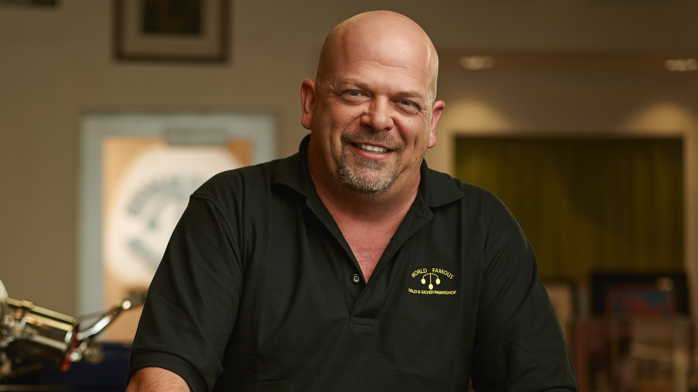

#Ok here is the official top 3 best copypastas ever

## Number 3

I'm **Rick Harrison**, and this is my *pawn shop*. I work here with my old man and my son, ~~Big Hoss~~. Everything in here has a story and a price. One thing I've learned after ***69*** years - 
>  you never know what is gonna come through that door

## Number 2
**The FitnessGram™ Pacer Test** is a multistage aerobic capacity test that progressively gets more *difficult* as it continues. The 20 meter pacer test will begin in 30 seconds. Line up at the start. The running speed starts slowly, but gets faster each minute after you hear this signal. [beep] A single lap should be completed each time you hear this sound. ***[ding]*** Remember to run in a *straight line*, and run as long as possible. The second time you fail to complete a lap before the sound, your test is over. The test will begin on the word start. On your mark, *get* *ready*, **start**.
